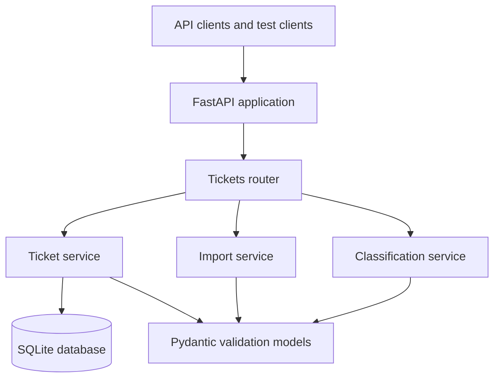
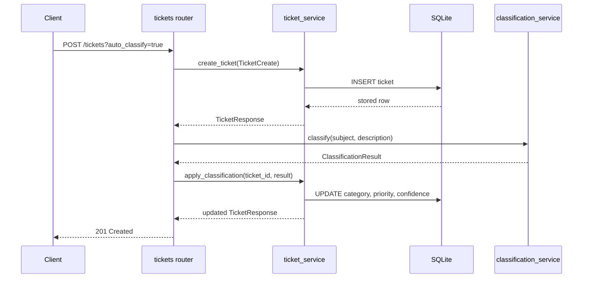
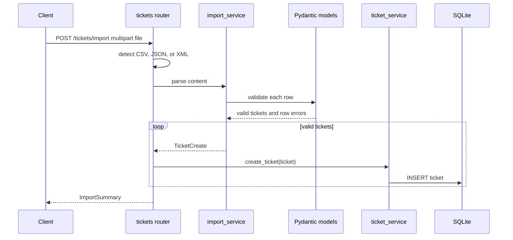

# Architecture

Audience: technical leads and reviewers evaluating maintainability, data flow, and trade-offs.

## System Context

The application is intentionally small and layered:

- `src/main.py` creates the FastAPI app, initializes SQLite during lifespan startup, and mounts routers.
- `src/routers/tickets.py` owns HTTP request/response handling, status codes, filters, uploads, and exception mapping.
- `src/models/ticket.py` defines Pydantic request, response, import summary, enum, and classification models.
- `src/services/ticket_service.py` contains SQLite-backed CRUD and classification persistence.
- `src/services/import_service.py` parses CSV, JSON, and XML into validated `TicketCreate` models.
- `src/services/classification_service.py` implements deterministic keyword classification.
- `src/database.py` owns the SQLite schema, connections, migrations, and row deserialization.

## Create Ticket Flow

## Bulk Import Flow

## Design Decisions

- FastAPI was chosen because request validation, OpenAPI generation, and async-ready routing are built in.
- SQLite keeps the homework project easy to run locally without external infrastructure.
- Pydantic models are the contract boundary for HTTP input, parser output, and service responses.
- Imports allow partial success. Valid records are stored even when other rows fail validation.
- Auto-classification is deterministic keyword matching instead of an external model call, which makes behavior testable, cheap, and reproducible.
- Tags and metadata are stored as JSON strings to keep the SQLite schema simple while preserving structured API responses.
- The import route accepts content type first and falls back to filename extension for common multipart clients.

## Trade-Offs

- SQLite is not ideal for high-write concurrent production workloads, but it is sufficient for local coursework and deterministic tests.
- The keyword classifier is transparent and stable, but it cannot understand nuanced language or intent beyond known phrases.
- The service layer uses direct SQL for simplicity. A larger system could justify an ORM, migrations, and repository interfaces.
- Import parsing currently loads the whole uploaded file into memory. Large production imports should stream records and enforce file-size limits.
- Authentication and authorization are out of scope for this homework implementation.

## Security Considerations

- Pydantic validates email format, enum values, subject length, and description length.
- SQL statements use parameter binding for user-controlled values.
- XML parsing uses `defusedxml` and rejects oversized XML imports before parsing.
- The API currently has no authentication. Do not expose it publicly without adding identity, authorization, rate limiting, and transport security.
- Uploaded files are parsed in memory and are not written to disk.

## Performance Considerations

- Listing tickets uses simple indexed-by-primary-key storage but no secondary indexes for filters.
- Bulk import inserts records one at a time. This is simple and reliable for assignment-sized fixtures; batch insert could improve throughput.
- Classification is O(number of configured keywords) per ticket and does not call network services.
- SQLite connection scope is per service call, which keeps lifecycle management simple but is less efficient than pooled database access in larger deployments.
