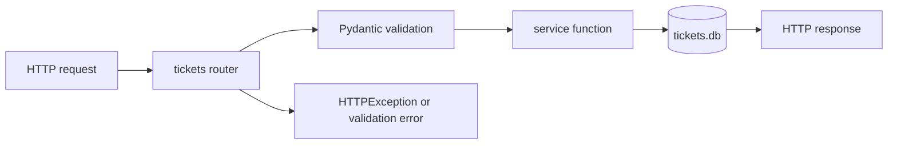

# Operations Runbook

Audience: maintainers running or troubleshooting the API locally.

## Start The Service

```bash
mise run dev
```

The service starts with uvicorn hot reload and initializes `tickets.db` during FastAPI lifespan startup.

Health smoke test:

```bash
curl "http://127.0.0.1:8000/tickets"
```

OpenAPI documentation:

```text
http://127.0.0.1:8000/docs
```

## Local Data

SQLite database file:

```text
tickets.db
```

The schema is defined in `src/database.py`. If the schema changes during local development, stop the server, remove `tickets.db`, and restart the service so the table is recreated.

## Common Troubleshooting

| Symptom | Likely Cause | Action |
|---|---|---|
| `ModuleNotFoundError` on startup | Dependencies are not installed | Run `uv sync` |
| `Address already in use` | Another server is using port 8000 | Stop the other process or run uvicorn with another port |
| `415 Unsupported Media Type` on import | Multipart content type or extension is not CSV, JSON, or XML | Set the upload content type or use a supported filename extension |
| `400 Bad Request` on import | Malformed JSON or XML | Validate the file syntax before retrying |
| `422 Unprocessable Entity` | Request body failed Pydantic validation | Check required fields, email format, lengths, and enum values |
| Missing `classification_confidence` | Ticket has not been auto-classified | Call `POST /tickets/{id}/auto-classify`, create with `auto_classify=true`, or import with `auto_classify=true` |

## Release Checklist

- Run `mise run lint:fix`.
- Run `mise run lint`.
- Run `mise run test`.
- Run `mise run test:cov`.
- Confirm docs reflect any endpoint, model, or command changes.
- Confirm sample import fixtures still match the parser expectations.

## Data Flow For Incident Debugging



Use this path to isolate issues:

- If the response is `422`, inspect the request schema and enum values.
- If the response is `400`, inspect uploaded file syntax.
- If the response is `404`, confirm the ticket ID exists in `tickets.db`.
- If persisted data is wrong, inspect service serialization for `tags`, `metadata`, and enum values.
