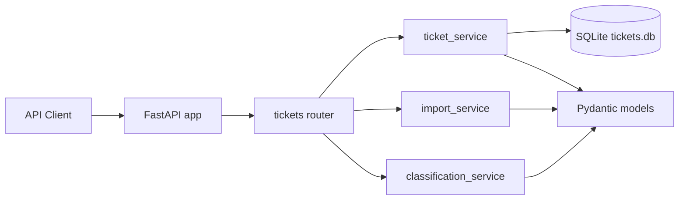

# 🎧 Homework 2: Customer Support Ticket API

> **Student Name**: Yurii Habrusiev
> **Date Submitted**: 2026-05-21
> **AI Tools Used**: GitHub Copilot CLI, OpenCode, Codex CLI and Zed; Claude Haiku 4.5 and Sonnet 4.6, GPT-5.5

---

FastAPI service for managing customer support tickets. The API supports CRUD operations, CSV/JSON/XML bulk import, keyword-based auto-classification, filtering, SQLite persistence, and a pytest suite for endpoint, parser, integration, and performance coverage.

## Features

- Create, read, update, delete, and filter support tickets.
- Import tickets from CSV, JSON, and XML files with partial-success summaries.
- Validate email addresses, string lengths, enum values, tags, and metadata with Pydantic v2.
- Auto-classify tickets by category and priority using deterministic keyword rules.
- Store tickets in SQLite with JSON-encoded tags and metadata.
- Run linting, formatting checks, type checks, and coverage with mise tasks.

## Architecture



## Setup

Prerequisites:

- Python 3.14
- uv
- mise

Install dependencies:

```bash
uv sync
```

Start the development server:

```bash
mise run dev
```

The API runs at `http://127.0.0.1:8000`. Interactive OpenAPI docs are available at `http://127.0.0.1:8000/docs`.

## Tests And Checks

Run the full test suite:

```bash
mise run test
```

Run coverage with the assignment threshold:

```bash
mise run test:cov
```

Run linting, format checks, and static type checks:

```bash
mise run lint
```

Auto-fix lint and formatting issues before final validation:

```bash
mise run lint:fix
mise run lint
```

## Project Structure

```text
homework-2/
├── src/
│   ├── main.py
│   ├── database.py
│   ├── models/
│   │   └── ticket.py
│   ├── routers/
│   │   └── tickets.py
│   └── services/
│       ├── classification_service.py
│       ├── import_service.py
│       └── ticket_service.py
├── tests/
│   ├── fixtures/
│   ├── test_ticket_api.py
│   ├── test_ticket_model.py
│   ├── test_import_csv.py
│   ├── test_import_json.py
│   ├── test_import_xml.py
│   ├── test_categorization.py
│   ├── test_integration.py
│   └── test_performance.py
├── API_REFERENCE.md
├── ARCHITECTURE.md
├── TESTING_GUIDE.md
├── OPERATIONS_RUNBOOK.md
├── TASKS.md
├── mise.toml
└── pyproject.toml
```

## Documentation Set

- `README.md`: developer overview and setup.
- `API_REFERENCE.md`: endpoint contract for API consumers.
- `ARCHITECTURE.md`: technical design for leads and reviewers.
- `TESTING_GUIDE.md`: QA workflow and validation checklist.
- `OPERATIONS_RUNBOOK.md`: local operation, troubleshooting, and maintenance notes.

## AI Documentation Strategy

The documentation was structured as if different model strengths were assigned by audience: a concise implementation-focused model for the README, a contract-focused model for the API reference, an architecture reasoning model for design documentation, a QA-focused model for the testing guide, and an operations-focused model for the runbook.

<div align="center">

*This project was completed as part of the AI-Assisted Development course.*

</div>
