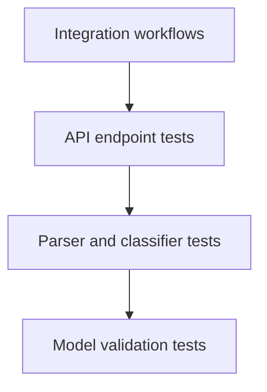

# Testing Guide

Audience: QA engineers validating functional behavior, edge cases, and assignment coverage.

## Test Pyramid



## Run Tests

Run all tests:

```bash
mise run test
```

Run coverage and enforce the required threshold:

```bash
mise run test:cov
```

Run code quality checks:

```bash
mise run lint
```

## Test Files

```text
tests/
├── conftest.py
├── fixtures/
│   ├── invalid_tickets.csv
│   ├── invalid_tickets.json
│   ├── invalid_tickets.xml
│   ├── sample_tickets.csv
│   ├── sample_tickets.json
│   └── sample_tickets.xml
├── test_ticket_api.py
├── test_ticket_model.py
├── test_import_csv.py
├── test_import_json.py
├── test_import_xml.py
├── test_categorization.py
├── test_integration.py
└── test_performance.py
```

## Coverage Targets

The assignment requires overall coverage above 85%. Use:

```bash
mise run test:cov
```

The configured task runs:

```bash
uv run pytest --cov=src --cov-report=term-missing --cov-fail-under=85
```

## Manual Testing Checklist

- Create a valid ticket and confirm `201 Created`.
- Create a ticket with invalid email and confirm `422 Unprocessable Entity`.
- Create a ticket with a short description and confirm validation error details.
- List tickets with no filters.
- List tickets with combined `status`, `category`, and `priority` filters.
- Get an existing ticket by ID.
- Get a missing ticket and confirm `404 Not Found`.
- Update a ticket to `resolved` and confirm `resolved_at` is populated.
- Delete a ticket and confirm a follow-up read returns `404 Not Found`.
- Import CSV, JSON, and XML fixture files.
- Import malformed JSON or XML and confirm `400 Bad Request`.
- Import an unsupported file type and confirm `415 Unsupported Media Type`.
- Run `POST /tickets/{id}/auto-classify` and confirm category, priority, confidence, reasoning, and keywords.
- Create a ticket with `auto_classify=true` and confirm classification fields are persisted.
- Import tickets with `auto_classify=true` and confirm classification fields are persisted.
- Filter imported records by combined `category` and `priority` query parameters.
- Exercise concurrent creation with 20 or more simultaneous requests.

## Performance Benchmarks

Timing thresholds are optional to avoid noisy CI failures. Set `RUN_PERFORMANCE_TESTS=1` to enforce them.

| Scenario | Expected Result | Validation Location |
|---|---:|---|
| Create ticket API call | Completes within test threshold | `tests/test_performance.py` |
| List tickets after seeded records | Completes within test threshold | `tests/test_performance.py` |
| CSV import fixture | Parses and stores within test threshold | `tests/test_performance.py` |
| JSON import fixture | Parses and stores within test threshold | `tests/test_performance.py` |
| XML import fixture | Parses and stores within test threshold | `tests/test_performance.py` |

## QA Notes

- Tests use local SQLite state prepared by the test fixtures.
- Fixture files under `tests/fixtures/` are the source of truth for import scenarios.
- `sample_tickets.csv`, `sample_tickets.json`, and `sample_tickets.xml` contain 50, 20, and 30 valid records respectively.
- API tests should assert both status codes and response bodies, especially for validation and partial import failures.
- Classifier tests should verify keywords, category, priority, confidence range, and persistence behavior separately.
