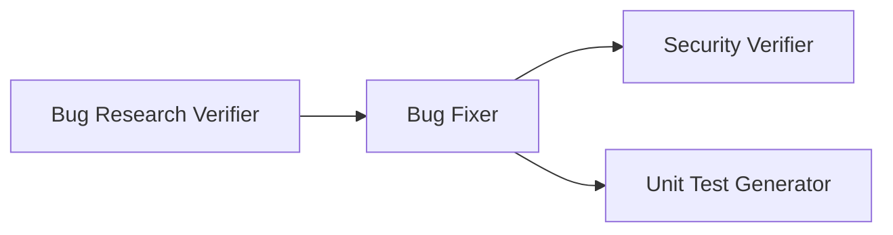

# 4-Agent Bug-Fix Pipeline

> **Student Name**: Yurii Habrusiev
> **AI Tools Used**: Claude Code (Sonnet 5 main session; subagents run on the models listed below)

---

## Project Overview

This homework implements a 4-agent Claude Code pipeline that verifies research, fixes a
bug, and independently checks the fix for security issues and test coverage. All four
agents and both required skills are implemented as **native Claude Code project
customizations** under `.claude/`, so they load automatically in any Claude Code session
opened in this repository — no separate framework or install step.



**Status**: Tasks 1–5 are complete. The four agents and two skills are ready to use, and
the sample application (Task 5, see [below](#sample-application-task-5)) is seeded with
its intentional bugs and security issue, ready for `./run-pipeline.sh` to fix.

## Where each deliverable lives

| TASKS.md deliverable | Actual location | Why |
|---|---|---|
| `agents/research-verifier.agent.md` | `.claude/agents/research-verifier.agent.md` | Same filename; moved under `.claude/agents/` so Claude Code loads it automatically as a real subagent. |
| `agents/bug-fixer.agent.md` | `.claude/agents/bug-fixer.agent.md` | Same reasoning as above. |
| `agents/security-verifier.agent.md` | `.claude/agents/security-verifier.agent.md` | Same reasoning as above. |
| `agents/unit-test-generator.agent.md` | `.claude/agents/unit-test-generator.agent.md` | Same reasoning as above. |
| `skills/research-quality-measurement.md` | `.claude/skills/research-quality-measurement/SKILL.md` | Claude Code skills must be `SKILL.md` inside their own directory — a flat file isn't loadable as a skill. |
| `skills/unit-tests-FIRST.md` | `.claude/skills/unit-tests-first/SKILL.md` | Same reasoning; directory name is the skill's slug. |
| `.claude/settings.json` | `.claude/settings.json` | Project permissions so the pipeline can run non-interactively via `run-pipeline.sh`. |

Claude Code loads any `.md` file under `.claude/agents/`, so keeping the `.agent.md`
double extension satisfies both the homework's required filename and Claude Code's
loading rules at the same time. Skills have a stricter, non-negotiable layout
(`.claude/skills/<slug>/SKILL.md`), which is why those moved to a directory form.

## Agent models and justification

| Agent | Model | Why |
|---|---|---|
| `research-verifier` | `opus` | Fact-checking is the trust gate for the whole pipeline — it must catch subtle fabrications, stale line numbers, and near-miss snippet drift that a weaker model would wave through. |
| `bug-fixer` | `sonnet` | Applies an already-vetted, concrete plan (exact before/after code) — mechanical execution, but precise multi-file edits still benefit from a capable model; doesn't need Opus-level judgment since the hard thinking already happened upstream. |
| `security-verifier` | `opus` | Security review requires the same strong reasoning as research verification — judging exploitability and severity nuance (e.g. timing-safe comparisons, injection vectors) benefits from the strongest available model, and this step is offline/non-latency-sensitive. |
| `unit-test-generator` | `haiku` | The most mechanical, highest-volume, lowest-reasoning-per-unit step: writing tests against a fixed diff and a fixed FIRST checklist. Best candidate for the fastest/cheapest model. |

This gives the pipeline a genuine range (opus → sonnet → haiku) matching the homework's
requirement to size the model to the task rather than using one model everywhere.

## Skills

- **`research-quality-measurement`** (`.claude/skills/research-quality-measurement/SKILL.md`):
  a four-level rubric (EXCELLENT / GOOD / FAIR / POOR) scored on reference accuracy,
  snippet fidelity, completeness, and absence of fabrication, with a deterministic
  decision procedure and a PASS / CONDITIONAL PASS / FAIL threshold. Used by
  `research-verifier`.
- **`unit-tests-first`** (`.claude/skills/unit-tests-first/SKILL.md`): the FIRST
  principles (Fast, Independent, Repeatable, Self-validating, Timely), each with concrete
  violations and a concrete check, plus a final self-review checklist. Used by
  `unit-test-generator`.

## Errata found in `TASKS.md`

While implementing this, I found a few inconsistencies in the provided `TASKS.md` and
resolved them as noted (rather than editing the original spec file):

1. **Expected Project Structure names the root folder `homework-5/`.** This is homework
   4 (confirmed against the repo root `README.md`, which lists homework-4 as "Multi-Agent
   System"). Treated as a copy-paste typo; this repo uses `homework-4/` throughout.
2. **The pipeline's "Run order" mentions a "Bug Researcher" and a "Bug Planner"** that
   produce `research/codebase-research.md` and `implementation-plan.md`, but only 4 agents
   (matching the mermaid diagram) are in scope for this homework. Those two upstream
   documents are treated as pre-existing inputs to `research-verifier` and `bug-fixer`
   respectively. In practice, `run-pipeline.sh` has the orchestrating Claude Code session
   itself produce them inline (as Stage 0 / Stage 2) when they don't already exist, so the
   pipeline is still fully self-contained behind one command — see `HOWTORUN.md`.
3. **Skill filenames in the deliverables table are flat `.md` files** (e.g.
   `skills/research-quality-measurement.md`), which isn't a loadable Claude Code skill.
   Resolved by using the required `.claude/skills/<slug>/SKILL.md` layout instead (see
   table above).

## Sample application (Task 5)

**Task Tracker API** — a small FastAPI service with an in-memory store, in
`src/task_tracker_api/` (mirrors the layout and tooling of `../homework-1`: Python 3.14,
`uv`, `mise`, `ruff`, `ty`), plus a `pytest` suite in `tests/`. See `HOWTORUN.md` for
exact setup/run/test commands.

It ships with three intentional, unrelated defects, bundled into a single bug case
(`context/bugs/001-task-api-defects/bug-context.md`) so one pipeline run can fix all of
them together:

1. **Bug — stats divide-by-zero**: `GET /tasks/stats` crashes with a 500 when there are
   no tasks yet (`src/task_tracker_api/store.py`, `stats()`).
2. **Bug — wrong priority sort**: `GET /tasks?sort=priority` returns tasks in
   alphabetical order (`high, low, medium`) instead of severity order
   (`high, medium, low`) (`src/task_tracker_api/store.py`, `list_tasks()`).
3. **Security issue — hardcoded secret + insecure comparison**: the admin bulk-delete
   endpoint checks a hardcoded API key literal with plain `==` instead of loading it from
   configuration and comparing it in constant time
   (`src/task_tracker_api/main.py`, `ADMIN_API_KEY` / `delete_all_tasks`).

Two tests in `tests/test_main.py` are pinned to fail against bugs 1 and 2 right now and
pass once they're fixed; there is deliberately no test for the security issue, since a
hardcoded/insecurely-compared key still authenticates correctly either way — it can only
be found by a code review, which is exactly what `security-verifier` is for.

All three were bundled into one bug case rather than three, because `security-verifier`
is strictly read-only and only ever reviews the files `bug-fixer` actually changed — for
the security issue to be "resolved after the pipeline," its fix has to be part of the
same `implementation-plan.md`/`fix-summary.md` as the other two.

## Directory structure (current)

```
homework-4/
├── README.md
├── HOWTORUN.md
├── TASKS.md
├── run-pipeline.sh
├── pyproject.toml, mise.toml, .python-version, .gitignore
├── src/task_tracker_api/
│   ├── __init__.py
│   ├── main.py       # routes + seeded admin-key security issue
│   ├── models.py     # Task, TaskCreate, Priority
│   └── store.py      # in-memory store + seeded stats/sort bugs
├── tests/
│   ├── conftest.py
│   └── test_main.py
├── .claude/
│   ├── settings.json
│   ├── agents/
│   │   ├── research-verifier.agent.md
│   │   ├── bug-fixer.agent.md
│   │   ├── security-verifier.agent.md
│   │   └── unit-test-generator.agent.md
│   └── skills/
│       ├── research-quality-measurement/SKILL.md
│       └── unit-tests-first/SKILL.md
├── context/
│   ├── README.md          # explains the context/bugs/<bug-id>/ convention
│   └── bugs/001-task-api-defects/
│       └── bug-context.md # the 3 seeded defects, reproduction steps, verification commands
└── docs/screenshots/
```

## Next step: running the pipeline

Everything is in place. Run `./run-pipeline.sh 001-task-api-defects` (or just
`./run-pipeline.sh`, since it's currently the only bug case) to exercise all four agents
end-to-end against the seeded defects above. See `HOWTORUN.md` for exact instructions,
including how to run and manually reproduce the app's bugs yourself first.
